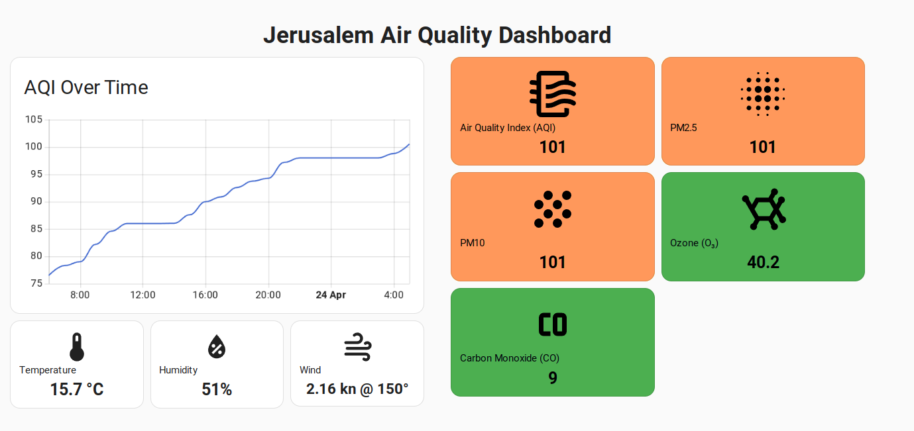
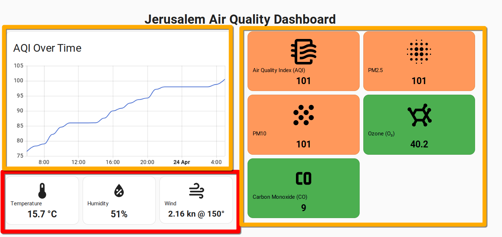

# Home Assistant Air Quality Dashboard



## Sensors Used

- [World Air Quality Index (WAQI)](https://www.home-assistant.io/integrations/waqi/) 
- [IMS Weather](https://github.com/GuyKh/ims-custom-component) 

## Widgets

Where I live (in Jerusalem) periodic forest fires can break out. 

Because local weather conditions are hugely important determinants impacting how pollutants move across the country (and world!) I added a few extra widgets from a weather plugin to develop a rounded picture.



## Limitations

While the 'gague' card in HA seems like an obvious candidate for an AQI widget, the ability to only define three levels of severity is a big limitation. 

[Six levels](https://www.airnow.gov/aqi/aqi-basics/) are suggested so ... color coding is the way to go to get a more granular interpretation. 

The values below could be mapped to interpretation logic

## Suggested Color Values For AQI Chart

 

| **Range**           | **Interpretation**                         | **Suggested Color**                |
|---------------------|--------------------------------------------|------------------------------------|
| 0 to 50             | Good                                       | Green (RGB: 0, 255, 0)             |
| 51 to 100           | Moderate                                   | Yellow (RGB: 255, 255, 0)          |
| 101 to 150          | Unhealthy for Sensitive Groups             | Orange (RGB: 255, 165, 0)          |
| 151 to 200          | Unhealthy                                  | Red (RGB: 255, 0, 0)              |
| 201 to 300          | Very Unhealthy                             | Purple (RGB: 128, 0, 128)          |
| 301 and higher      | Hazardous                                  | Maroon (RGB: 128, 0, 0)           |


## AQI Widget With Suggested Color Coding

```yaml
type: custom:button-card
entity: sensor.jerusalem_yshrl_usalem_air_quality_index
name: Air Quality Index (AQI)
icon: mdi:air-filter
show_state: true
show_name: true
show_icon: true
styles:
  card:
    - padding: 10px
  state:
    - font-size: 20px
    - font-weight: bold
  name:
    - font-size: 12px
    - align-self: start
    - justify-self: start
    - padding-bottom: 5px
  icon:
    - width: 30%
    - align-self: end
    - justify-self: end
state:
  - value: unavailable
    styles:
      card:
        - background-color: "#777777"
  - value: unknown
    styles:
      card:
        - background-color: "#777777"
  - operator: template
    value: "[[[ return !isNaN(entity.state); ]]]"
    styles:
      card:
        - background-color: |
            [[[
              var aqi = parseFloat(entity.state);
              if (aqi <= 50) return '#4CAF50'; // Green
              if (aqi <= 100) return '#FFEB3B'; // Yellow
              if (aqi <= 150) return '#FF9800'; // Orange
              if (aqi <= 200) return '#F44336'; // Red
              if (aqi <= 300) return '#9C27B0'; // Purple
              if (aqi > 300) return '#79000F'; // Maroon
              return '#777777'; // Default grey
            ]]]
      name:
        - color: |
            [[[
              var aqi = parseFloat(entity.state);
              if (aqi > 150) return 'white';
              return 'black';
            ]]]
      state:
        - color: |
            [[[
              var aqi = parseFloat(entity.state);
              if (aqi > 150) return 'white';
              return 'black';
            ]]]
      icon:
        - color: |
            [[[
              var aqi = parseFloat(entity.state);
              if (aqi > 150) return 'white';
              return 'black';
            ]]]
```

## Markdown Reference Widget

This simple markdown widget can provide quick info for AQI values:

Sure! Here's the markdown representation of the AQI interpretations:

```markdown
### AQI Interpretations:
- **Good (0-50):** Air quality is considered satisfactory, and air pollution poses little or no risk.
- **Moderate (51-100):** Air quality is acceptable; however, there may be some health concerns for sensitive individuals.
- **Unhealthy for Sensitive Groups (101-150):** Members of sensitive groups may experience health effects, but the general public is less likely to be affected.
- **Unhealthy (151-200):** Everyone may begin to experience health effects; sensitive groups may experience more severe health effects.
- **Very Unhealthy (201-300):** Health alert; everyone may experience more serious health effects.
- **Hazardous (301+):** Health warnings of emergency conditions; the entire population is more likely to be affected.
```